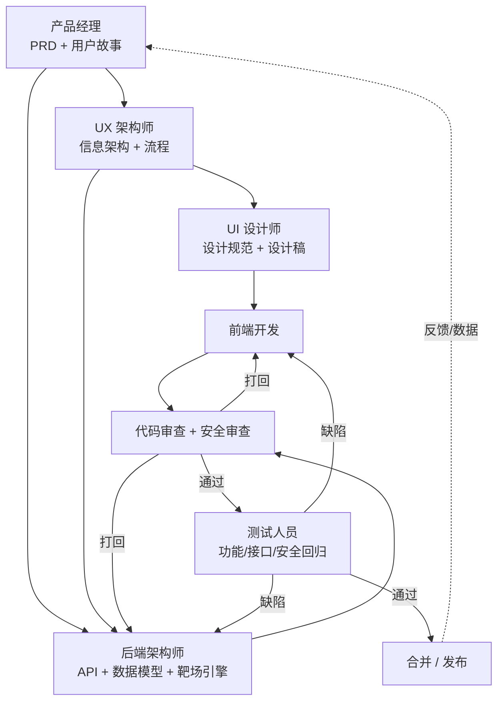

# vul-labs 多角色协作开发工作流

> 产品定位：**开源漏洞靶场 / 安全练习平台**（内置可被攻击的漏洞环境，供用户学习、复现、训练，类似 DVWA / Pikachu / CTF 训练场），前后端结合。

本工作流定义了 **产品(PM) → UI/UX → 前端 → 后端 → 代码审查 → 测试** 六个角色如何协作、各自的输入/产出、交接物（Artifact）以及质量门禁（Quality Gate）。每个角色既可以是真人，也可以映射为一个 AI 智能体。

---

## 一、角色与智能体映射

| 角色 | 职责一句话 | 对应智能体 | 核心产出 |
|------|-----------|-----------|---------|
| 产品经理 (PM) | 定义"做什么、为什么、给谁用" | `产品经理` | PRD、用户故事、验收标准、优先级 |
| UX 架构师 | 信息架构、流程、技术可行的 UX 基建 | `UX 架构师` | 信息架构图、用户流程、布局框架 |
| UI 设计师 | 视觉系统、组件库、像素级界面 | `UI 设计师` | 设计规范、组件库、页面设计稿 |
| 前端开发 | 实现界面与交互 | `前端开发者` | 前端代码、可交互页面 |
| 后端架构/开发 | API、数据模型、靶场引擎 | `后端架构师` | API、数据库、靶场容器编排 |
| 代码审查 | 安全/正确性/可维护性把关 | `代码审查员` + `安全工程师` | 审查报告、必改项清单 |
| 测试人员 | 功能/接口/安全回归验证 | `API 测试员` / `测试结果分析师` | 测试用例、测试报告、缺陷单 |
| （编排者） | 串联流程、推进交接 | `智能体编排者` | 流水线状态、阻塞项 |

> 漏洞靶场特殊性：**安全工程师全程参与**。靶场里的"漏洞"是**刻意设计的功能**，而平台本身（账号、计分、沙箱隔离）必须是**安全的**。代码审查环节必须区分"靶场内可控漏洞"与"平台真实漏洞"。

---

## 二、工作流总览



每个箭头都对应一次**交接（Handoff）**，交接必须携带标准化的交付物（见第四节）。

---

## 三、阶段详解

### 阶段 0：立项与对齐（PM 主导）
- **输入**：业务目标、目标用户（安全初学者 / 红队训练 / 高校教学）、约束（开源、自托管）
- **活动**：定义产品愿景、靶场范围（覆盖哪些漏洞类型：SQLi / XSS / SSRF / 文件上传 / 反序列化 ...）、MVP 范围
- **产出**：`docs/product/PRD.md`、用户故事列表、按优先级排序的 backlog
- **质量门禁 G0**：每个用户故事都有明确的验收标准（Given/When/Then）；MVP 范围被冻结

### 阶段 1：体验设计（UX → UI）
- **输入**：PRD、用户故事
- **UX 活动**：信息架构（靶场列表 / 靶场详情 / 计分 / 用户中心 / 后台）、关键用户流程（注册→选靶→启动环境→攻击→提交 flag→计分）、布局与状态（加载/空/错误/沙箱启动中）
- **UI 活动**：设计令牌（色板/字体/间距）、组件库、关键页面高保真稿、深色模式（安全工具习惯）
- **产出**：`docs/design/UX-architecture.md`、`docs/design/UI-spec.md`、组件清单
- **质量门禁 G1**：覆盖全部核心流程；包含异常态；无障碍对比度达标；与 PRD 用户故事一一对应

### 阶段 2：架构与契约（后端 + 前端并行起步）
- **输入**：PRD、UX 流程
- **活动**：定义 **API 契约（OpenAPI）** 为前后端共同事实来源；数据模型；靶场运行引擎方案（每个靶场=独立容器，按需启停，做好网络/资源隔离）；鉴权与计分服务设计
- **产出**：`docs/api/openapi.yaml`、`docs/arch/backend.md`、`docs/arch/lab-engine.md`
- **质量门禁 G2**：API 契约评审通过；沙箱隔离方案经安全工程师确认（容器逃逸/横向移动/资源耗尽已被考虑）

### 阶段 3：实现（前端 // 后端 并行）
- **前端**：按设计稿与 OpenAPI 实现页面与交互，Mock 数据先行，联调后替换
- **后端**：实现 API、数据库迁移、靶场容器编排、计分/flag 校验
- **产出**：可运行代码 + 单元测试 + 本地一键启动（docker-compose）
- **质量门禁 G3**：本地可启动；单测覆盖核心逻辑；前后端按 OpenAPI 联调通过

### 阶段 4：代码审查（双轨）
- **轨道 A — 通用代码审查**（`代码审查员`）：正确性、可维护性、性能、依赖安全
- **轨道 B — 平台安全审查**（`安全工程师`）：**重点区分**
  - 平台自身漏洞（鉴权绕过、越权、计分作弊、SSRF 打到内网、容器逃逸）= **必须修复**
  - 靶场内的"漏洞" = **预期行为，不修，但必须沙箱隔离、有明确边界、不可影响平台与其他用户**
- **产出**：审查报告 + `BLOCKER / SHOULD-FIX / NICE-TO-HAVE` 分级清单
- **质量门禁 G4**：无 BLOCKER；所有"靶场漏洞"都标注了隔离边界

### 阶段 5：测试与验收（测试人员）
- **功能测试**：按用户故事的验收标准逐条验证
- **接口测试**：基于 OpenAPI 的契约/边界/异常测试
- **安全回归**：靶场漏洞可被复现（教学目标达成）、平台漏洞不可被利用、沙箱启停/隔离有效
- **产出**：测试报告、缺陷单、回归用例集
- **质量门禁 G5**：核心用户故事全部通过；无 P0/P1 缺陷；安全回归通过 → 允许合并/发布

### 阶段 6：发布与反馈回流
- 发布后收集使用数据与用户反馈 → 回流到 PM 的 backlog，进入下一迭代。

---

## 四、标准化交接物（Artifact 契约）

交接不靠口头，靠文件。约定仓库目录：

```
docs/
  product/   PRD.md, user-stories.md, backlog.md      ← PM
  design/    UX-architecture.md, UI-spec.md           ← UX/UI
  api/       openapi.yaml                              ← 后端(前后端共识)
  arch/      backend.md, lab-engine.md, threat-model.md← 后端/安全
  review/    review-<feature>.md                       ← 代码审查
  qa/        test-plan.md, test-report-<n>.md          ← 测试
WORKFLOW.md                                            ← 本文件
```

**交接检查单（每次 Handoff 必须满足）**：
1. 产出物已更新到上述对应目录
2. 与上游产物可追溯（用户故事 ID 贯穿 PRD→设计→API→测试）
3. 对应阶段质量门禁通过

---

## 五、迭代节奏与反馈循环

- 采用小步快跑：每个迭代只交付 1～3 个用户故事的完整闭环（PM→…→测试）。
- **打回机制**：审查/测试发现问题 → 退回前端或后端 → 修复后重新过门禁（G4/G5），不跳步。
- **反馈回路**：测试数据与线上反馈 → PM 重排 backlog。

---

## 六、漏洞靶场专属安全基线（贯穿全流程）

| 关注点 | 要求 |
|--------|------|
| 沙箱隔离 | 每个靶场实例独立容器/网络命名空间；限制 CPU/内存/磁盘；禁止访问平台内网与元数据服务 |
| 生命周期 | 靶场按需启动、超时自动销毁、用户间不复用实例 |
| 平台 vs 靶场 | 计分、鉴权、用户数据等"平台面"必须安全；"靶场面"漏洞可控且隔离 |
| 防作弊 | flag 服务端校验、每用户/每实例 flag 唯一或加盐、防爆破限流 |
| 责任边界 | 明确"靶场漏洞=预期"，避免审查/测试误报为平台缺陷 |

---

## 七、如何用智能体跑这条流水线

1. **PM** → 调度 `产品经理`，输入业务目标，产出 `docs/product/PRD.md`。
2. **UX/UI** → 调度 `UX 架构师` + `UI 设计师`，输入 PRD，产出 `docs/design/*`。
3. **后端** → 调度 `后端架构师`，输入 PRD+UX，产出 `docs/api/openapi.yaml` 与架构/靶场引擎设计。
4. **前端** → 调度 `前端开发者`，输入设计稿+OpenAPI，产出前端实现。
5. **审查** → 调度 `代码审查员` + `安全工程师`，产出分级审查报告。
6. **测试** → 调度 `API 测试员` / `测试结果分析师`，产出测试报告与缺陷单。
7. （可选）由 `智能体编排者` 统筹各角色交接与阻塞项推进。

> 当前迭代已先行启动 **步骤 1（PM）与步骤 2（UX/UI）**，产出第一版需求与设计；前端/后端/审查/测试在契约确定后进入。
