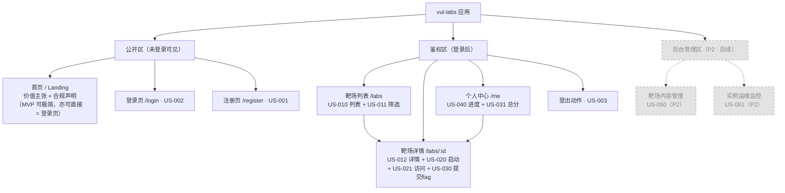
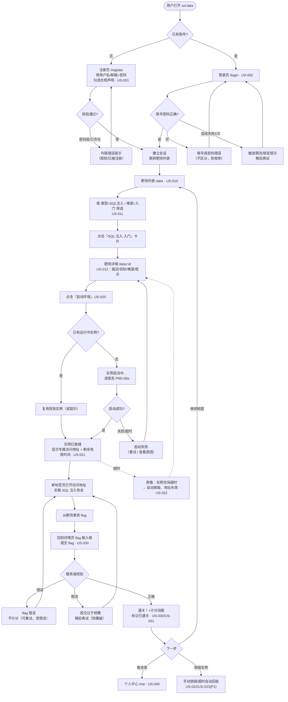
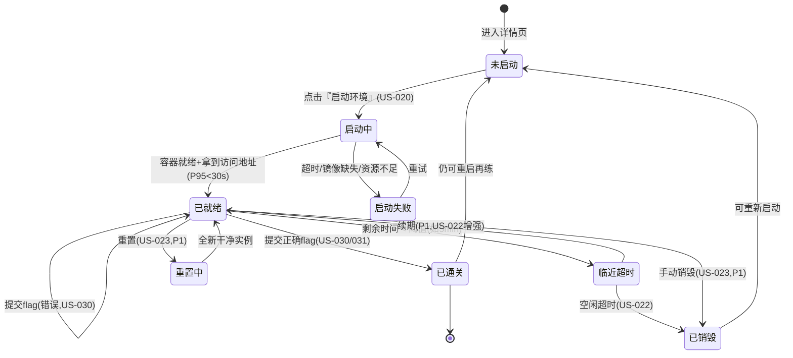
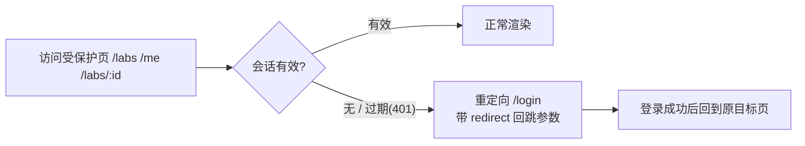

# vul-labs（漏洞盒子）UX 架构文档

**Status**: Draft v0.1（第一版，面向 G1 评审）
**Author**: UX 架构师
**Last Updated**: 2026-06-09
**上游输入**: [PRD](../product/PRD.md) · [用户故事](../product/user-stories.md) · [Backlog](../product/backlog.md) · [工作流](../WORKFLOW.md)
**下游交接**: UI 设计师（UI-spec.md）、后端架构师（openapi.yaml / lab-engine.md）、前端开发者

> **本文档目标**：把 PRD 的需求与用户故事转化为**信息架构、用户流程、页面布局框架、状态设计、导航与响应式策略、无障碍要点**，给 UI 设计与前后端开发打地基。
> **追溯原则**：每个页面/流程/状态都标注对应用户故事 ID（US-xxx），与 PRD 保持双向可追溯。
> **聚焦原则**：紧扣**第一迭代（Sprint 1）闭环** —— `登录 → 浏览/筛选靶场 → SQL 注入靶场详情 → 一键启动实例 → 攻击 → 提交 flag → 通关计分`，同时把 Sprint 2 页面（列表/筛选/详情/个人中心）一并纳入信息架构以保证一致性与可扩展性。

---

## 0. UX 架构总览（关键决策摘要）

| # | 决策 | 理由 | 关联 |
|---|------|------|------|
| D1 | **深色优先（dark-first）**，提供 深色/浅色/跟随系统 三态切换 | 安全工具用户习惯深色（PRD §7 可用性）；但靶场内容可读性要求高对比度 | NFR |
| D2 | **桌面优先**响应式（≥1024px 为主战场，≥768/≥640 渐进降级） | 攻击练习需要多窗口/工具切换，移动端非核心场景（Backlog 明确不做移动 App） | NFR |
| D3 | **实例状态机作为一等公民**贯穿详情页与全局横幅 | 启动中/就绪/超时销毁是本产品最独特、风险最高的状态，必须有清晰的视觉与反馈 | US-020/021/022 |
| D4 | **靶场实例在新标签页打开攻击**，平台页面保留实例控制器 | 攻击靶场会注入 XSS/上传 webshell，必须与平台页面**同源隔离**，避免污染平台会话 | PRD §8 安全边界 |
| D5 | **flag 提交锚定在靶场详情页**（而非弹窗深处），随时可见可达 | 闭环的"临门一脚"，降低用户找入口的成本 | US-030 |
| D6 | **全局合规免责横幅 + 注册勾选确认** | PRD §8.3 合规硬要求 | Backlog P0 配套 |
| D7 | **空/加载/错误/异常态先于正常态设计** | 实例编排天然慢且易失败，异常态是体验成败关键 | US-010/020/030 |

---

## 1. 信息架构（站点地图）

### 1.1 站点地图



### 1.2 页面清单与追溯

| 路由 | 页面 | 鉴权 | 迭代 | 对应 US | 说明 |
|------|------|------|------|---------|------|
| `/` | 首页/Landing | 公开 | S1（可极简） | — | 价值主张 + 合规声明；MVP 可直接重定向到 `/login` 或 `/labs` |
| `/register` | 注册 | 公开 | S1（带出） | US-001 | 含合规勾选 |
| `/login` | 登录 | 公开 | S1 | US-002 | 失败限流提示 |
| `/labs` | 靶场列表 | 需登录 | S1（最小）/S2（完整筛选） | US-010, US-011 | 列表 + 筛选 + 通关状态 |
| `/labs/:id` | 靶场详情 | 需登录 | S1 | US-012, US-020, US-021, US-022, US-030 | **第一迭代闭环主战场** |
| `/me` | 个人中心 | 需登录 | S2 | US-040, US-031 | 进度/总分/最近活动 |
| `(action) logout` | 登出 | 需登录 | S1/S2 | US-003 | 顶栏菜单触发 |
| `/admin/*` | 后台 | 管理员 | P2 后续 | US-050, US-051 | **本版仅占位标注，不展开设计** |

> **第一迭代最小集**：`/login`（+`/register` 带出）→ `/labs`（最小列表，至少能进入 SQL 注入靶场）→ `/labs/:id`（详情+启动+提交 flag）。`/me` 在 Sprint 2 补全，但本文档先给出布局以保证 IA 一致。

### 1.3 全局导航层级

- **一级导航（顶栏）**：`靶场`（/labs）· `我的进度`（/me）· 右侧：主题切换 + 用户菜单（含登出）。
- 排行榜、后台为 P2，导航中**预留位但不显示**，避免误导。
- 导航项 ≤ 5 个，符合"主导航 5–7 项"上限。

---

## 2. 关键用户流程（第一迭代闭环）

### 2.1 端到端主流程（Happy Path + 关键分支）

覆盖：`注册 → 登录 → 浏览/筛选 → SQL 注入详情 → 一键启动 → 攻击 → 提交 flag → 通关计分`。



### 2.2 实例生命周期状态机（US-020/021/022/023）

这是本产品最独特的交互，单独建模，前端据此实现状态轮询与 UI 切换。



> **状态↔UI 映射**详见 §4 状态设计。前端通过轮询/SSE 获取实例状态，详情页的"启动区块"按状态机切换呈现。

### 2.3 鉴权守卫流程（US-003 会话）



---

## 3. 关键页面布局框架（Wireframe 级）

> 约定：以下为**桌面（≥1024px）**布局；响应式降级见 §5。`[ ]` 表示区块，`( )` 表示控件/状态。

### 3.1 全局框架（App Shell）

所有登录后页面共享统一外壳：

```
┌──────────────────────────────────────────────────────────────┐
│ [合规横幅] ⚠ 仅限合法授权环境内学习使用 · 靶场为隔离沙箱  (×可收起) │  ← PRD §8.3 / D6
├──────────────────────────────────────────────────────────────┤
│ [顶栏 TopNav]                                                   │
│  (Logo vul-labs)   [靶场] [我的进度]      (🌓主题) (👤用户▾登出) │  ← US-003 登出
├──────────────────────────────────────────────────────────────┤
│ [全局实例状态条 GlobalInstanceBar] (仅当有运行中实例时出现)        │
│  🟢 SQL注入-入门 运行中 · ⏱ 剩余 42:15 · (访问) (销毁)            │  ← US-020/021/022, D3
├──────────────────────────────────────────────────────────────┤
│                                                                │
│ [主内容区 Main Outlet]  ← 各页面在此渲染                          │
│                                                                │
├──────────────────────────────────────────────────────────────┤
│ [页脚] 开源协议 · 免责声明 · 文档链接                              │
└──────────────────────────────────────────────────────────────┘
```

**区块职责**：
- **合规横幅**：常驻提醒合法使用边界，可收起（记忆偏好），首次访问默认展开。
- **顶栏**：一级导航 + 主题切换 + 用户菜单（登出入口）。
- **全局实例状态条**：跨页面追踪"我当前有没有跑着的靶场"，提供快速"访问/销毁"，避免用户忘记实例在烧资源。**仅在有活跃实例时出现**。
- **页脚**：合规与开源信息。

### 3.2 登录页 `/login`（US-002）

```
┌───────────────────────────────────────────┐
│              (Logo) vul-labs                │
│           登录以进入你的练习靶场              │
│                                             │
│   [ 用户名 / 邮箱 ____________________ ]      │
│   [ 密码     ____________________ (👁) ]      │
│                                             │
│   ( 登录 )  ← 主按钮，全宽                    │
│   (登录失败内联区：账号或密码错误)             │  ← 防枚举文案
│   (限流区：尝试过多，请 N 秒后再试)            │  ← US-002 限流
│                                             │
│   还没有账号? → 去注册                        │
└───────────────────────────────────────────┘
   居中卡片，最大宽度 ~400px，深色背景
```

**职责**：单一聚焦登录，错误**内联**展示（不弹窗），区分"凭证错误"与"限流"两类反馈。

### 3.3 注册页 `/register`（US-001）

```
┌───────────────────────────────────────────┐
│              注册 vul-labs 账号              │
│   [ 用户名 ____________________ ]            │
│   [ 邮箱   ____________________ ]            │
│   [ 密码   ____________________ (👁) ]        │
│     (密码强度条 ▮▮▮▯▯  至少8位…)  ← 实时校验   │  US-001
│   [ 确认密码 __________________ ]            │
│                                             │
│   [✓] 我已阅读并同意：仅在合法授权环境内使用    │  ← D6 合规勾选(必勾)
│   ( 注册 )  ← 未勾选/校验未过则禁用            │
│   (错误区：用户名已被注册 / 密码不满足规则)     │
│                                             │
│   已有账号? → 去登录                          │
└───────────────────────────────────────────┘
```

**职责**：实时密码强度反馈；合规勾选为提交前置；错误就近字段内联提示。

### 3.4 靶场列表 `/labs`（US-010 / US-011）

```
┌──────────────────────────────────────────────────────────────┐
│ 靶场                                       (🔎搜索  ← P1占位)    │
├───────────────┬──────────────────────────────────────────────┤
│ [筛选侧栏]      │ [结果区]                                       │
│  漏洞类型       │  共 N 个靶场  · (已选筛选标签 ⓧ清除)            │
│  ☑ SQL注入     │  ┌─────────────┐ ┌─────────────┐             │
│  ☐ XSS         │  │[靶场卡片]    │ │[靶场卡片]    │             │
│  ☐ 文件上传     │  │ SQL注入-入门 │ │ 反射XSS-入门 │             │
│                │  │ 🏷SQLi 🟢入门 │ │ 🏷XSS 🟢入门  │             │
│  难度           │  │ ✅已通关/未开始│ │ ○ 未开始     │             │
│  ☐ 入门        │  │ 分值: 100    │ │ 分值: 100    │             │
│  ☐ 中等        │  └─────────────┘ └─────────────┘             │
│  ☐ 困难        │  ┌─────────────┐                             │
│                │  │ 文件上传-中等 │  (响应式 auto-fit 卡片网格)   │
│  (清除全部筛选) │  │ 🏷Upload 🟡中  │  min 280px                  │
│                │  └─────────────┘                             │
└───────────────┴──────────────────────────────────────────────┘
```

**区块职责**：
- **筛选侧栏**（US-011）：类型 + 难度多选，多条件取交集；提供"清除筛选"。移动端折叠为顶部"筛选"抽屉。
- **靶场卡片**：名称、漏洞类型标签、难度标签（颜色编码）、**我的通关状态**（✅已通关 / ○未开始）、分值。整卡可点击进详情。
- **结果区头部**：结果计数 + 已选筛选 chips（可单独移除）。
- 卡片网格用 CSS Grid `auto-fit, minmax(280px, 1fr)`。

### 3.5 靶场详情 `/labs/:id`（第一迭代闭环主战场）

> 覆盖 US-012 详情 · US-020 启动 · US-021 访问 · US-022 超时 · US-030 提交 flag。采用**左右双栏**：左=任务说明，右=操作与计分（粘性）。

```
┌──────────────────────────────────────────────────────────────┐
│ ‹ 返回靶场列表                                                  │
│ SQL 注入 - 入门      🏷SQLi  🟢入门  分值100   [✅已通关·6/9 12:30]│  ← US-012/031
├────────────────────────────────┬─────────────────────────────┤
│ [左栏 · 任务说明]                │ [右栏 · 操作面板(粘性 sticky)] │
│                                 │                               │
│ ## 场景描述                      │ ┌─[实例控制器]──────────────┐ │
│ 一个存在 SQL 注入的登录框…        │ │ 状态: ● 未启动             │ │  ← US-020 状态机
│                                 │ │ ( ▶ 启动环境 )  主按钮     │ │
│ ## 攻击目标                      │ │ ───────────────────────  │ │
│ 绕过登录 / 读取 flag 表          │ │ (就绪后变为:)              │ │
│                                 │ │ 🟢 已就绪                  │ │
│ ## 提示 (可折叠,默认收起)         │ │ 访问地址: http://…:32790  │ │  ← US-021
│ ▸ 提示1: 试试 ' or 1=1 --        │ │ (🔗 在新标签打开) (📋复制) │ │  ← D4 新标签
│ ▸ 提示2: …                       │ │ ⏱ 剩余 58:12              │ │  ← US-022
│                                 │ │ (♻ 重置 P1) (🗑 销毁 P1)   │ │
│ ## 漏洞类型说明 / 学习要点        │ └───────────────────────────┘ │
│                                 │ ┌─[Flag 提交]───────────────┐ │
│ (维护不可用时: 启动入口禁用       │ │ [ flag{__________} ____ ] │ │  ← US-030
│  + 原因提示, US-012)             │ │ ( 提交 flag )             │ │
│                                 │ │ (成功/失败/限流 反馈区)     │ │
│                                 │ └───────────────────────────┘ │
└────────────────────────────────┴─────────────────────────────┘
```

**区块职责**：
- **头部**：靶场元信息 + 通关徽标（已通关时显示通关时间，US-012）。
- **左栏任务说明**：描述、目标、**提示（可折叠，默认收起，US-012）**、学习要点。**绝不出现正确 flag**（PRD §8 / US-012 安全约束）。
- **右栏实例控制器**（粘性）：按 §2.2 状态机切换——未启动 / 启动中 / 已就绪（地址+倒计时+复制+新标签打开）/ 失败（重试）/ 临近超时 / 已销毁。
- **右栏 Flag 提交**（US-030）：始终可见（D5），与实例控制器同栏；提交后内联反馈成功/失败/限流。已通关后输入框可保留但提示"已通关（重复提交不再加分）"。

### 3.6 个人中心 `/me`（US-040 / US-031，Sprint 2）

```
┌──────────────────────────────────────────────────────────────┐
│ 我的进度                                                        │
│ ┌──────────┐ ┌──────────┐ ┌──────────┐                        │
│ │ 总得分    │ │ 已通关    │ │ 通关率    │   ← 概览卡 US-031/040 │
│ │  300      │ │  3 / 9   │ │  33%     │                        │
│ └──────────┘ └──────────┘ └──────────┘                        │
├──────────────────────────────────────────────────────────────┤
│ [已通关靶场]                          [最近活动]                 │
│  ✅ SQL注入-入门  100分  6/9 12:30      · 通关 SQL注入 6/9 12:30  │
│  ✅ 反射XSS-入门  100分  6/8 20:10      · 启动 文件上传 6/8 …     │
│  ✅ 文件上传-中等 100分  6/7 …           · 登录 6/7 …             │
│                                                                │
│ (空状态: "还没通关任何靶场～ (去练习→)")  ← US-040 空状态         │
└──────────────────────────────────────────────────────────────┘
```

**职责**：概览卡（总分/通关数/通关率）+ 已通关列表 + 最近活动时间线；空状态给鼓励文案与"去练习"CTA。**仅展示本人数据**（US-040 越权约束）。

---

## 4. 关键状态设计

> 原则（D7）：**异常态先行**。每个数据/动作区块都需定义 5 类基础态（加载 / 空 / 错误 / 成功 / 受限），实例与 flag 额外有专属态。

### 4.1 通用页面/数据态

| 状态 | 触发 | 视觉表现 | 文案/行为 | US |
|------|------|---------|----------|----|
| 加载中 | 列表/详情请求中 | 骨架屏（卡片占位），非空白 | — | US-010 |
| 空状态-列表 | 无任何靶场 | 居中插画 + 文案 | "暂无靶场" | US-010 |
| 空状态-筛选 | 筛选无结果 | 居中提示 + (清除筛选) | "无匹配靶场" | US-011 |
| 空状态-进度 | 未通关任何靶场 | 鼓励文案 + (去练习) | US-040 | US-040 |
| 加载错误 | 接口 5xx/网络失败 | 错误卡 + (重试) | "加载失败，请重试" | 通用 |
| 鉴权失效 | 401/会话过期 | 重定向登录 + toast | "登录已过期，请重新登录" | US-003 |

### 4.2 实例状态（产品核心，US-020/021/022/023）

| 状态 | UI 呈现（详情页右栏 + 全局状态条） | 主要操作 | 文案要点 |
|------|-----------------------------------|---------|---------|
| **未启动** | 灰点 ● + 主按钮『启动环境』 | 启动 | "点击启动一个专属隔离实例" |
| **启动中** | 蓝色脉冲 + 进度提示 + 不确定进度条 | （禁用，防重复点） | "正在拉起实例…通常 < 30s（首次拉镜像可能更久）" |
| **已就绪** | 🟢绿点 + 访问地址 + 复制/新标签 + 倒计时 | 访问 / 复制 / 销毁(P1) / 重置(P1) | "实例已就绪，剩余 58:12" |
| **启动失败** | 🔴红点 + 错误原因 + (重试) | 重试 | "启动失败：镜像缺失/资源不足，请重试或稍后再试" |
| **临近超时** | 🟠橙色倒计时高亮 + (续期 P1) | 续期(P1) | "实例 5 分钟后将被回收，注意保存进度" |
| **已销毁/超时** | 灰点 + 旧地址置灰 + (重新启动) | 重新启动 | "实例已回收，访问地址已失效。可重新启动" US-022 |
| **复用提示** | 进入时检测到已有运行实例 | 访问 / 重新启动 | "你已有一个运行中的实例" US-020 |

> 实例状态同时驱动**全局状态条**（§3.1），保证用户在任意页面都知道"有实例在跑 + 剩余时间"，可一键访问或销毁，呼应 D3。

### 4.3 Flag 提交态（US-030）

| 状态 | 视觉 | 文案/行为 |
|------|------|----------|
| 默认 | 输入框 + 提交按钮 | 占位符 `flag{...}` |
| 提交中 | 按钮 loading | 禁用重复提交 |
| **成功通关** | 绿色成功卡 + 计分 +100 动画 + 徽标点亮 | "🎉 通关！+100 分" → 详情头部出现"已通关" |
| 失败 | 红色内联 + 输入框抖动 | "flag 错误，再试试（注意大小写/格式）" 不计分 |
| 重复通关 | 中性提示 | "已通关，重复提交不再加分"（幂等，US-030） |
| 限流 | 橙色提示 + 倒计时 | "提交过于频繁，请 N 秒后再试"（防爆破，US-030） |

> **安全约束（贯穿）**：前端任何状态、任何接口响应都**不得包含正确 flag**；校验完全在服务端（PRD §8 / US-012 / US-030）。

---

## 5. 导航结构与响应式策略

### 5.1 导航结构

- **顶栏（一级）**：`靶场` `我的进度` + 主题切换 + 用户菜单（个人中心/登出）。当前页高亮（aria-current）。
- **面包屑式回退**：详情页提供"‹ 返回靶场列表"，减少依赖浏览器后退。
- **全局实例状态条**：跨页持久导航元素，点"访问"直达实例、"销毁"就地回收。
- **登录态守卫**：未登录访问受保护路由 → 重定向登录并带回跳（§2.3）。
- 预留但不显示：排行榜、后台（P2）。

### 5.2 响应式断点策略（桌面优先，D2）

| 断点 | 宽度 | 布局变化 |
|------|------|---------|
| 大屏 | ≥1280px | 列表 4 列卡片；详情双栏舒展，右栏粘性 |
| 桌面（主） | ≥1024px | 列表 3 列；详情左右双栏；筛选常驻侧栏 |
| 平板 | ≥768px | 列表 2 列；详情双栏收窄或右栏移到下方；筛选变顶部抽屉 |
| 手机 | <768px | 列表单列；详情**单栏堆叠**（说明在上、实例控制器+flag 提交吸底/置顶）；筛选为抽屉；全局状态条简化为一行 |

> 移动端不是核心攻击场景，但需保证"看进度、查看实例状态、提交 flag"可用（降级而非阉割）。详情页移动端把**实例控制器与 flag 提交置顶/吸底**，保证闭环关键操作触手可及。

### 5.3 主题策略（D1）

- 三态切换：`深色（默认）/ 浅色 / 跟随系统`，偏好持久化（localStorage），SSR/首屏防闪烁。
- 深色为默认且为设计基准；浅色为完整对照主题（非附属）。
- 主题 Token 由 UI 设计师在 UI-spec.md 落地具体色值；本文仅约定**语义化变量命名**（如 `--bg-primary` / `--text-primary` / `--state-success` / `--state-danger` / `--state-warning` / `--instance-ready` 等），禁止硬编码色值。

---

## 6. 可用性与无障碍要点

| 维度 | 要求 | 落地点 |
|------|------|--------|
| **对比度** | 正文/重要文本 ≥ WCAG 2.1 AA（普通文本 4.5:1，大字 3:1）；深色与浅色双主题都需达标 | 全站；状态色不可仅靠颜色区分 |
| **状态不仅靠颜色** | 实例/flag 状态同时用**图标 + 文字 + 颜色**三重编码 | §4 状态色配图标与文案（色盲友好） |
| **键盘可达** | 所有交互（导航、筛选、启动、复制地址、提交 flag、销毁）可 Tab 到达并 Enter/Space 触发；可见焦点环 | 表单、按钮、卡片链接 |
| **焦点管理** | 路由切换后焦点移到主标题；弹窗/抽屉打开聚焦其内、关闭归还触发元素；错误出现后聚焦首个错误字段 | 登录/注册错误、筛选抽屉 |
| **明确反馈** | 每个动作有即时反馈（loading/成功/失败）；耗时操作（启动实例）有进度与预期时间 | §4 各态 |
| **语义化与 ARIA** | 语义标签（nav/main/section/h1-h3 层级）；状态用 `aria-live="polite"`（实例状态/倒计时）与 `assertive`（flag 提交结果）播报；表单 label 关联 | App Shell、实例控制器、提交反馈 |
| **倒计时无障碍** | 实例剩余时间用 `aria-live` 周期播报（避免过于频繁），临近超时升级提醒 | 实例控制器 |
| **可点击区域** | 按钮/卡片点击区 ≥ 44×44px（移动端）；CTA 文案明确（"启动环境""提交 flag"而非"确定"） | 全站 |
| **防误操作** | "销毁/重置实例"二次确认（避免误删正在练的环境） | US-023 |
| **合规可见性** | 免责声明在首页/注册可见且可读，不被弱化隐藏 | PRD §8.3 |

---

## 7. 用户故事追溯矩阵（US ↔ UX 产出）

| US ID | 名称 | 优先级 | 第一迭代 | 涉及页面 | 涉及流程(§2) | 涉及状态(§4) |
|-------|------|--------|---------|---------|-------------|-------------|
| US-001 | 用户注册 | P0 | ◐带出 | §3.3 注册页 | §2.1 注册分支 | 校验错误/合规勾选 |
| US-002 | 用户登录 | P0 | ✅ | §3.2 登录页 | §2.1 登录分支 | 凭证错误/限流 |
| US-003 | 登出与会话 | P0 | （S1/S2） | App Shell 用户菜单 | §2.3 鉴权守卫 | 鉴权失效重定向 |
| US-010 | 浏览靶场列表 | P0 | （S2，S1 最小） | §3.4 列表 | §2.1 浏览 | 加载/空/错误 |
| US-011 | 筛选靶场 | P0 | （S2） | §3.4 筛选侧栏 | §2.1 筛选 | 筛选空状态 |
| US-012 | 靶场详情 | P0 | ✅ | §3.5 详情 | §2.1 进入详情 | 维护不可用态 |
| US-020 | 启动实例 | P0 | ✅ | §3.5 实例控制器 + 全局状态条 | §2.1 启动 / §2.2 状态机 | 未启动/启动中/失败/复用 |
| US-021 | 访问/攻击实例 | P0 | ◐ | §3.5 访问地址区 | §2.1 攻击（新标签 D4） | 已就绪 |
| US-022 | 超时自动销毁 | P0 | ◐ | §3.5 倒计时 + 全局状态条 | §2.1 旁路 / §2.2 | 临近超时/已销毁 |
| US-023 | 手动销毁/重置 | P1 | — | §3.5 销毁/重置按钮 | §2.2 状态机 | 重置中/已销毁（二次确认） |
| US-030 | 提交 flag 计分 | P0 | ✅ | §3.5 flag 提交区 | §2.1 提交 | 成功/失败/重复/限流 |
| US-031 | 计分规则展示 | P0 | （S2） | §3.4 卡片分值 / §3.5 头部 / §3.6 总分 | §2.1 计分 | 成功+计分动画 |
| US-040 | 个人进度 | P0 | （S2） | §3.6 个人中心 | §2.1 看进度 | 空状态/越权约束 |
| US-041 | 排行榜 | P2 | — | （导航预留位） | — | — |
| US-050 | 靶场内容管理 | P2 | — | §1.1 后台占位 | — | — |
| US-051 | 实例运维监控 | P2 | — | §1.1 后台占位 | — | — |

> ✅=第一迭代核心闭环；◐=支撑闭环的最小实现；（S2）=Sprint 2 补全但已纳入 IA。

---

## 8. 给下游的交接说明（Handoff）

### 8.1 给 UI 设计师（UI-spec.md）
- 落地**深色为基准**的双主题 Design Token：语义化色板（含 `--instance-*` / `--state-*` 状态色，需满足 AA 对比度且色盲友好）、字号阶梯、间距系统、卡片/按钮/输入/标签/徽标组件。
- 重点高保真页面优先级：**详情页（含实例控制器 6 态 + flag 提交 4 态）> 列表 > 登录/注册 > 个人中心**。
- 实例状态的图标体系（启动中/就绪/失败/超时）需可在深浅两主题下辨识。

### 8.2 给后端架构师（openapi.yaml / lab-engine.md）
- 前端依赖的**实例状态查询/轮询接口**：需返回 `status`（unstarted/provisioning/ready/failed/expiring/destroyed）、`accessUrl`、`expiresAt`，以驱动 §2.2 状态机与 §3.1 全局状态条。
- **flag 提交接口**：响应区分 `correct / incorrect / rate-limited / already-passed`，且**响应体绝不含正确 flag**。
- 401 语义统一（驱动 §2.3 守卫与回跳）。
- 列表接口需附带**当前用户通关状态**字段（驱动卡片 ✅ 标记）。

### 8.3 一致性与可扩展
- 排行榜/后台（P2）已在 IA 预留位，未来加入不破坏现有导航。
- 所有页面复用 App Shell（顶栏 + 合规横幅 + 全局实例状态条 + 页脚），保证跨页一致。

---

## 附录：本版未展开（标注后续）
- **后台管理区**（US-050/051，P2）：仅在 §1.1 站点地图占位，待 Web 端闭环成熟后单独出 UX。
- **搜索、提示分级、实例续期**（P1）：在详情/列表已预留入口位（搜索框占位、提示折叠结构、续期按钮位），交互细化待对应迭代。
